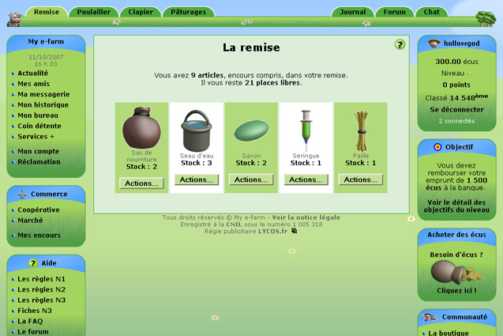

<h1 align="center">
   
  
   
  My e-Farm Revival
   
</h1>

<h4 align="center">Renaissance du jeu de simulation de ferme en ligne My e-Farm.</h4>

  <a href="#introduction">Introduction</a> •
  <a href="#objectif-du-jeu">Objectif du Jeu</a> •
  <a href="#technologies-et-bibliothèques">Technologies et Bibliothèques</a> •
  <a href="#sécurité-et-authentification">Sécurité et Authentification</a> •
  <a href="#monétisation">Monétisation</a> •
  <a href="#comment-contribuer">Comment Contribuer</a> •
  <a href="#licence">Licence</a>

## Introduction

Ce projet vise à faire revivre le jeu en ligne populaire My e-Farm, un jeu de simulation de ferme en temps réel inspiré par Ogame. Les joueurs peuvent gérer leur propre ferme, élever des animaux, acheter des ressources, atteindre des objectifs spécifiques, et interagir avec d'autres joueurs.

## Objectif du Jeu

Les joueurs commencent avec une petite exploitation et des ressources limitées. Leur objectif est de développer leur ferme, d'améliorer leurs compétences et de rembourser leurs dettes. À chaque niveau, les joueurs ont de nouvelles responsabilités et la possibilité d'améliorer leurs installations.

## Technologies et Bibliothèques

### Frontend
- JavaScript
- Vue.js avec Vite.js
- Gestion du temps avec Day.js ou Luxon

### Backend
- Node.js
- Base de données SQL avec PostgreSQL

## Sécurité et Authentification

Nous utilisons une authentification basique avec la possibilité d'ajouter une authentification à deux facteurs (2FA) et une connexion via passkey.

## Monétisation

Les joueurs pourront acheter des écus (la monnaie du jeu), mais nous cherchons une solution pour éviter que le jeu ne devienne un "pay to win".

## Comment Contribuer

Nous accueillons les contributions de toute personne intéressée par ce projet. Veuillez lire les [directives de contribution](CONTRIBUTING.md) avant de commencer.

## Licence

Ce projet est sous licence MIT. Voir le fichier [LICENSE](LICENSE.md) pour plus de détails.